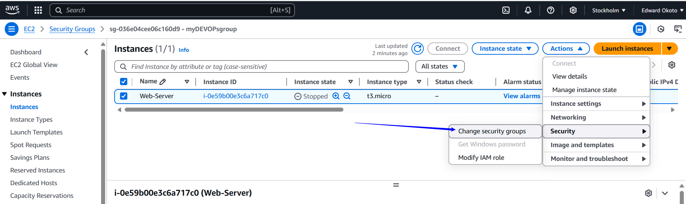

# Security Groups and NACLs

### Project Goals
* Understand the concept of security groups and Network Control List in AWS
* Explain how Security groups and NACL function as virtual firewall to control inbound and outbound traffic.
* Gain hands on experience with configuring Security and NACLs to allow and deny specifc type of traffic.

### What are security groups
Security groups in Amazon Web Services (AWS) act as virtual firewalls for your EC2 instances to control inbound and outbound traffic. They play a crucial role in securing your AWS resources by defining the rules that specify which traffic is allowed or denied.

##### Key Features of Security Groups:
* Stateful Rules:

  Security groups are stateful, meaning that if you allow an inbound request from an IP address, the response to that request is automatically allowed, regardless of outbound rules.

* Inbound and Outbound Rules:

  You can define rules to control both incoming (inbound) and outgoing (outbound) traffic. Each rule specifies the protocol, port range, and source or destination IP address.

* Default Deny Policy:

  By default, all inbound traffic is denied unless explicitly allowed by a rule. For outbound traffic, all traffic is allowed by default, but you can create rules to restrict it.

* Apply to Multiple Instances:

  A single security group can be applied to multiple EC2 instances. This allows for easy management and consistency across similar instances.

* Attach and Detach:

  Security groups can be attached or detached from instances without stopping them. This makes it easy to update security settings on the fly.

* Example Use Case:

  Imagine you have a web server running on an EC2 instance. You would create a security group with the following rules:

  Inbound Rules:

   * Allow HTTP traffic on port 80 from any IP address (0.0.0.0/0).

  * Allow HTTPS traffic on port 443 from any IP address (0.0.0.0/0).

  * Allow SSH traffic on port 22 from your specific IP address for administrative access.

  Outbound Rules:

  * Allow all outbound traffic to the internet (default setting).

  Benefits of Using Security Groups:

  * Enhanced Security: Fine-grained control over traffic to and from your instances.

  * Simplicity: Easy to create, manage, and apply to multiple instances.

  * Flexibility: Rules can be updated at any time without needing to restart instances.

  * Scalability: Suitable for both small and large-scale deployments.

Security groups are an integral part of AWS network security, ensuring that only the desired traffic reaches your instances while protecting them from unauthorized access.

### What is NACL
A Network ACL (NACL) in Amazon Web Services (AWS) is a security layer that acts as a virtual firewall for controlling inbound and outbound traffic at the subnet level within a Virtual Private Cloud (VPC). Unlike Security Groups, which operate at the instance level, NACLs provide additional security controls at the subnet level, allowing you to define granular traffic rules for your entire subnet.

#####  Key Features of NACLs:
  * Stateless Rules:

    * NACLs are stateless, meaning that each request and response is evaluated based on the rules set. If you allow inbound traffic, you must explicitly allow the corresponding outbound traffic.

 * Rules Evaluation:

   * Rules are evaluated in order, starting from the lowest rule number to the highest. The evaluation stops as soon as a rule matches the traffic, either allowing or denying it.

 * Inbound and Outbound Rules:

   * You can define separate rules for inbound and outbound traffic. Each rule specifies the protocol, port range, and source/destination IP address.

 * Default Deny Policy:

   * By default, all inbound and outbound traffic is denied unless explicitly allowed by a rule.

 * Subnet Level Control:

   * NACLs are associated with subnets, and the rules apply to all instances within the associated subnet.

Example Use Case:

Imagine you have a VPC with both public and private subnets:

  * Public Subnet NACL:

    * Inbound Rules: Allow HTTP traffic on port 80 from any IP address (0.0.0.0/0).

    * Outbound Rules: Allow all outbound traffic to the internet.

* Private Subnet NACL:

   * Inbound Rules: Allow traffic only from specific IP ranges within the VPC (e.g., from the public subnet).

  * Outbound Rules: Allow traffic to specific IP ranges within the VPC or to a NAT Gateway for internet access.

Benefits of Using NACLs:

Additional Layer of Security: Provides an extra layer of security at the subnet level, supplementing Security Groups at the instance level.

Fine-Grained Control: Offers detailed control over traffic to and from your subnets, enabling more precise security configurations.

Flexibility: Can be used in conjunction with Security Groups to create comprehensive security policies for your VPC.

Comparison between Security Group and NACL.

NACLs and Security Groups can be used together to provide a multi-layered security approach, enhancing the overall security posture of your AWS environment.

# PRACTICALS

### Creating Security Groups

 * Navigate to the security group section and Click on "Create security group"
 
    
 * Name and describe the security group
 * Select desired VPC during creation

 * Click on "Add rule" in the inbound rule section.

    

 * Select "HTTP" as the type

    Use 0.0.0.0/0 as the CIDR Block (We are allowing every CIDR block by using this CIDR)

    Repeat same process to add SSH and HTTPS inbound rules.

     

 * Keep the Outbound rule as it is or edit as desired but generally we want to keep our inbound watertight and our outbound explorable.

 * Then Click "Create security group"

    

   The Security Group has been created successfully.
     
     

    #### Next lets attach the security group to an EC2 instance.

  * Navigate to the instance section of left side bar.

     a) Select the instance

     b) Click on "Actions"

     c) Choose "Security"

     

  * Click on "Change security group"
      
      

  * Select the newly created security group in the drop-down,the click "Add security group" and then on "Save"

      

      

      Security group has been attached successfully

      

      If you copy the IP address of the ECS instance and type http://(the INSTANCE IP address), you will get a response of the web browser.

      

      Without allowing the HTTP inbound traffic,the web page wont display. We can confirm this by editing the security group and removing the rules to allow HTTP traffic and reload the webpage.

      
      

    
 ### Creating NACL

 * Navigate to search bar and type VPC.
 * Click VPC

   

* Navigate to Network ACLs and Click " Create network ACL"

   
 
* Provide a name for your Network ACL.
* Choose the desired VPC and click "Create network ACL"

   

* Select the NACL created and navigate to the inbound rule and by default you would notice it is denying all traffic from all ports.
  
  

* Notice as well that its the same by default in the outbound rule.
  

* Go to "Inbound rules" and click "Edit inbound rules"

    

* Click on "Add new rule"
   
   Choose the rule number

   specify the type

   Select the source

   Allow or deny traffic and click " Save changes"

    
    

    Inbound rule is created but the NACL is without association.
    

* Lets associate it.

  Select the NACL

  Click on "Actions"

  Select "Edit subnet associations"
   
  

* Select the subnet you want to associate the NACL with and click "Save changes" . In our case its the public subnet.

  

  My public subnet has been successfully associated with the created NACL.

  

  NACL unlike Security group which are stateful, are stateless, you must allow the traffic in both direction for connectivity ( both inbound and outbound). Therefore, allow such desired traffics in the outbound direction as well.

   

* Click on "Outbound rule" and edit the rule as done for inbound.Then click save changes.
   
    
    

  BOTH THE SECURITY GROUP AND NACL have been successfuly configured.